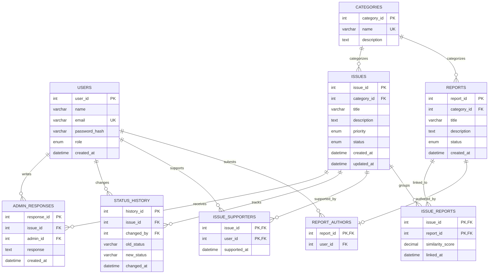
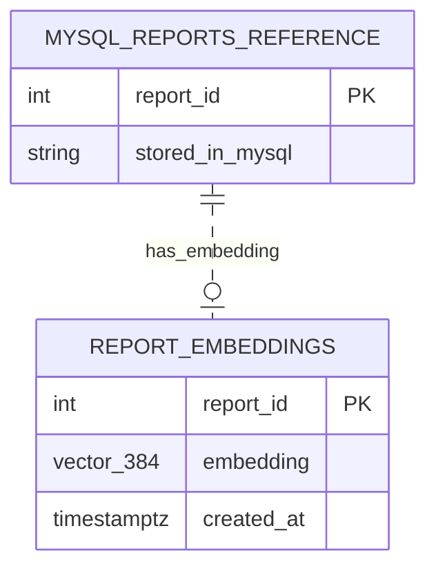

# WhisperNet ER diagrams

The MySQL diagram reflects the transactional schema. The Supabase diagram reflects the vector store. The dotted edge is only a logical cross-database reference; it is not enforced as a foreign key.

## MySQL

## Supabase PostgreSQL (pgvector)

`report_embeddings.report_id` is the MySQL report's ID. PostgreSQL has a primary key on it and an HNSW index using `vector_cosine_ops`; it does not have a database-enforced foreign key because the referenced `REPORTS` row lives in MySQL.
